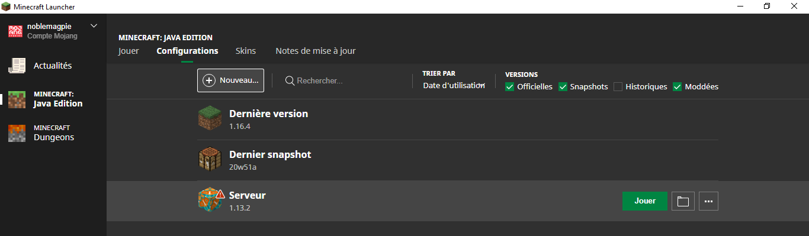

# Comment installer Minecraft
# Windows

Attention, on suppose que vous ayez déjà un compte Mojang ou Microsoft pour *Minecraft Java Edition*. Si ce n'est pas le cas, il faut acheter une licence. Le prix, le modèle des licences et la modalité d'achat changent tout le temps.

[https://www.minecraft.net/en-us/store/minecraft-java-edition](Pour acheter Minecraft Java Edition)

## Installer le *minecraft launcher*

Aller sur le site [https://www.minecraft.net/fr-fr/download](https://www.minecraft.net/fr-fr/download), télecharger et installer.

Une fois installé et lancé, vous pouvez vous connecter avec votre identifiant et vous arrivez sur cette page:

## Télécharger la version correcte du logiciel

Quand vous souhaitez vous connecter à un serveur, vous devez savoir:
- l'adresse du serveur
- la version du serveur

Il faut que vous installiez la version du logiciel qui correspond exactement à celle du serveur.

Pour rajouter une version de Minecraft, cliquez sur *Configurations* et ensuite sur *Nouveau*.

Ensuite, vous cherchez la version désirée. Dans notre cas, le serveur utilise la version 1.13.2.

En survolant la nouvelle version avec la souris, vous voyez apparaître *Jouer*. Cliquez et attendez.

Une fois lancé, selectionnez Multi-joueur

Il faudra ensuite rajouter le serveur via le bouton "Nouveau serveur" en bas à droite.

Insérez l'adresse qu'on vous a communiquée et ensuite validez par *Terminé*.

Vous êtes maintenant prêt! Cliquez sur le serveur fraîchement créé.

