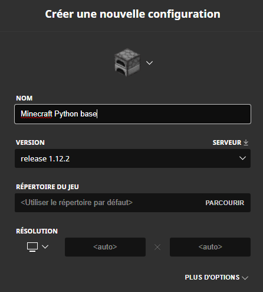
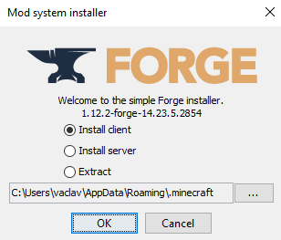
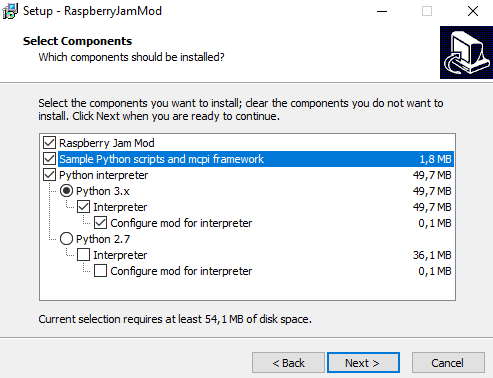
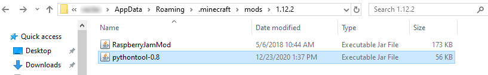
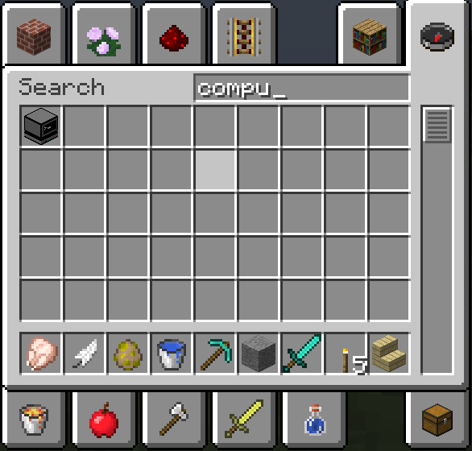
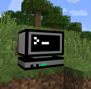
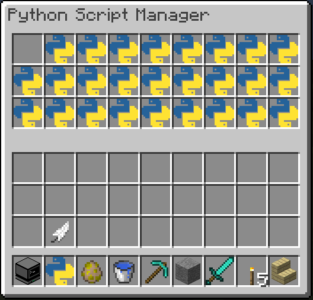

# Installer Python pour Minecraft
# Windows

Nous allons installer la version 1.12.2 de Minecraft pour ensuite rajouter Python.

Ces instructions se basent sur celles trouvées sur [instructables](https://www.instructables.com/Python-coding-for-Minecraft/).

## Installer la bonne version de Minecraft

Depuis le *Launcher*, cliquez sur *Configurations* et ensuite *Nouveau*.

## Télécharger et installer Java

Si Java n'est pas présent, vous pouvez le [télecharger](https://www.java.com/en/download/) et ensuite l'installer.

## Installer Minecraft-forge

Vous devez télécharger Minecraft-Forge 1.12.2 et ensuite l'installer. Vous pouvez le trouver sur [cette page](http://files.minecraftforge.net/maven/net/minecraftforge/forge/index_1.12.2.html) et voici aussi le [lien directe](
https://files.minecraftforge.net/maven/net/minecraftforge/forge/1.12.2-14.23.5.2854/forge-1.12.2-14.23.5.2854-installer.jar)

Pour installer Forge, il suffit de double-cliquer sur le fichier fraîchement téléchargé qui doit avoir une icône de tasse

Installer le client uniquement:

## Installation de RaspberryJam Mod, Python et PythonTool-Mod

Un installateur complet est disponible pour Windows. Vous pouvez le trouver à [cette page](https://github.com/arpruss/raspberryjammod/releases) et voici aussi le [lien directe](https://github.com/arpruss/raspberryjammod/releases/download/0.94/RaspberryJamMod-Installer.exe).

Double-cliquez sur l'installateur et sélectionnez comme ci-dessous:

Il vous faudra ensuite [télécharger PythonTool-Mod](https://ngcm.github.io/PythonTool-Mod/downloads/) (voici aussi le [lien direct](https://github.com/ngcm/PythonTool-Mod/blob/master/mod_jars/1.12.2/pythontool-0.8.jar). Vous devez déposer ce fichier sans l'exécuter dans le répertoire */Users/votre_user_name/AppData/Roaming/.minecraft/mods/1.12.2/*

## Lancez Minecraft Forge

Maintenant, vous pouvez lancer Minecraft Forge 1.12.2 depuis le Launcher. Pour vérifier que les mods et scripts sont bien là, il faut créer un nouveau monde en mode créatif et chercher l'ordinateur dans la boîte à outils. 

Installez-le

Vous pouvez récupérer les scripts avec un click droit sur l'ordinateur et ensuite les utiliser comme n'importe quel autre objet.

